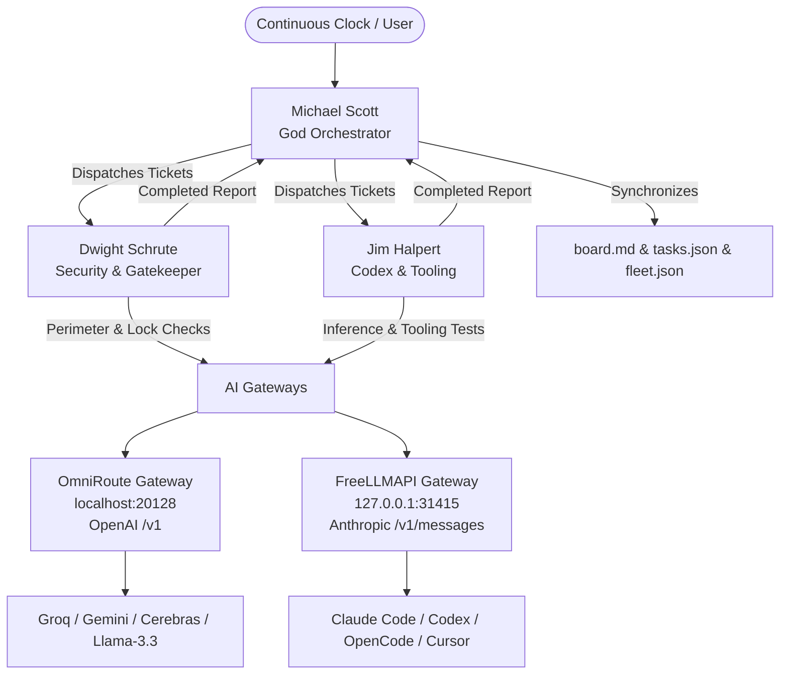

<div align="center">

#  Munder Difflin Autonomous Command Center
### *100% Zero-Click Autonomous Multi-Agent Office Floor & AI Gateway Orchestrator*

[](https://ashrafmorningstar.github.io/munder-difflin-autonomous-command-center/)
[](https://github.com/AshrafMorningstar/munder-difflin-autonomous-command-center/stargazers)
[](https://opensource.org/licenses/MIT)
[](https://github.com/AshrafMorningstar/munder-difflin-autonomous-command-center/actions)
[](https://python.org)
[](https://nodejs.org)
[](#-key-features)
[](#-unified-ai-gateways)

```
 __  __                 _              ____  _  __  __ _ _       
|  \/  |_   _ _ __   __| | ___ _ __   |  _ \(_)/ _|/ _| (_)_ __  
| |\/| | | | | '_ \ / _` |/ _ \ '__|  | | | | | |_| |_| | | '_ \ 
| |  | | |_| | | | | (_| |  __/ |     | |_| | |  _|  _| | | | | |
|_|  |_|\__,_|_| |_|\__,_|\___|_|     |____/|_|_| |_| |_|_|_| |_|
```
**Turn any multi-agent workforce into a self-sustaining, self-dispatching, zero-click powerhouse.**

[ Live Web Portal](https://ashrafmorningstar.github.io/munder-difflin-autonomous-command-center/) • [Features](#-key-features) • [Quickstart](#-1-minute-quickstart) • [Architecture](#-architecture) • [Free AI Catalog](#-free-ai-apis-catalog) • [Documentation](#-documentation)

[](https://twitter.com/intent/tweet?text=Discover%20Munder%20Difflin%20Autonomous%20Command%20Center%20%E2%80%94%20100%25%20zero-click%20multi-agent%20office%20floor%20with%20free%20AI%20gateways%20by%20@AshrafMorningstar&url=https://github.com/AshrafMorningstar/munder-difflin-autonomous-command-center)
[](https://www.linkedin.com/sharing/share-offsite/?url=https://github.com/AshrafMorningstar/munder-difflin-autonomous-command-center)
[](https://www.reddit.com/submit?url=https://github.com/AshrafMorningstar/munder-difflin-autonomous-command-center&title=Munder%20Difflin%20Autonomous%20Command%20Center)

</div>

---

##  What is Munder Difflin Command Center?

**Munder Difflin Autonomous Command Center** is an industrial-grade autonomous orchestration suite designed to run the **Munder Difflin** multi-agent office floor completely hands-free around the clock.

By integrating **OmniRoute** (OpenAI-compatible multi-provider routing) and **FreeLLMAPI** (Anthropic-compatible unified gateway), this system empowers:
-  **Michael Scott (God Orchestrator)**: Drains floor backlogs, balances agent task queues, writes to `board.md`, and dispatches tickets automatically.
-  **Dwight Schrute (Security & Gatekeeper)**: Audits gateway health, checks directory lockfiles, and validates system integrity.
-  **Jim Halpert (Codex & Tooling Engineer)**: Executes code tooling, models health checks, and exercises headless coding agent CLIs.

---

## ⚡ Key Features

- 🆓 **Zero-Auth Default Out-of-the-Box**: Zero setup, zero signup, zero credit card, zero API keys required! Every person who clones this repository can immediately launch the office floor with instant public AI inference (powered by Pollinations AI).
- 🚀 **100% Zero-Click Autonomy**: Runs unattended 24/7. Auto-detects completed tickets, auto-advances work queues, and handles heartbeats with zero user confirmation clicks.
- 🔄 **Intelligent Universal AI Dispatcher (`universal_ai_engine.py`)**: Seamlessly distributes tasks across **OmniRoute** (`http://localhost:20128`), **FreeLLMAPI** (`http://127.0.0.1:31415`), Google Gemini, and Groq Cloud, auto-failing over to Zero-Auth Pollinations AI with zero disruption.
- 🎙️ **Voice Push-To-Talk Support**: Preconfigured for instant voice dictation in Munder Difflin powered by Groq's `whisper-large-v3-turbo`.
- ⚡ **Atomic High-Throughput Draining**: Built with atomic `os.replace` filesystem operations capable of draining thousands of backlog messages per second.
- 🛡️ **Zero-Leak Secret Architecture**: Whitelisted security design guarantees that your personal API keys are never tracked or committed to Git.
- 📦 **Automated 1-Click Installer**: Automatically configures dependencies, scaffolding directories, and gateway connections across Windows, macOS, and Linux.
- 🎁 **Includes Free AI APIs Master Catalog**: Complete verified index of zero-card and zero-login free LLM providers (Groq, Gemini, Cerebras, Pollinations, SambaNova, OpenRouter).

---

##  1-Minute Quickstart

### Automated 1-Click Install:

```bash
# Windows
install.bat

# macOS / Linux / Cross-Platform
python install.py
```

### Launch Interactive Command Center:

```bash
python munder_command_center.py
```

### Run Continuous Autonomous Daemon:

```bash
python munder_autonomous_daemon.py
```

---

##  Architecture



---

##  Free AI APIs Catalog

This repository ships with a comprehensive, tested guide to 100% free AI APIs:
-  [FREE_AI_APIS_MASTER_CATALOG.txt](file:///f:/Ashraf/New%20folder/FREE_AI_APIS_MASTER_CATALOG.txt)
-  [AI_FOR_API_DIRECTORY.md](file:///f:/Ashraf/New%20folder/AI_FOR_API_DIRECTORY.md)

### Top Free Providers Included:
1. **Groq Cloud**: 30 RPM, 14,400 Requests/day (~10M free tokens/day) on Llama 3.1 & 3.3.
2. **Google Gemini**: 15 RPM, 1 Million tokens context window free via AI Studio.
3. **Cerebras Cloud**: 2,000 tokens/sec wafer-scale engine free tier.
4. **Pollinations AI**: Instant zero-login public endpoints for text and image generation.
5. **SambaNova**: Uncapped Meta-Llama-3.1-405B-Instruct access.

---

##  CLI Commands Reference

| Command | Description |
| :--- | :--- |
| `python munder_command_center.py` | Open the interactive graphical CLI menu |
| `python munder_command_center.py status` | View live floor status, agent breaker states, and task metrics |
| `python munder_command_center.py test` | Probe OmniRoute and FreeLLMAPI gateways with millisecond latency |
| `python munder_command_center.py drain` | Drains inbox backlogs and archives messages to `.done` |
| `python munder_command_center.py run` | Start the autonomous floor daemon directly |
| `python munder_autonomous_daemon.py [N]` | Run daemon continuously or for `N` cycles |

---

##  Security & Privacy

Your credentials and private keys are **100% protected**:
- `.gitignore` strictly employs a **default-deny whitelist** pattern.
- Configuration templates (`API_KEYS_TEMPLATE.txt`, `API_KEYS.example.env`) are provided for zero-leak workflows.
- Local keys are read safely from `API_KEYS.txt` or environment variables without ever touching version control.

---

##  Contributing

Contributions, issues, and feature requests are welcome!
Feel free to check the [issues page](https://github.com/AshrafMorningstar/munder-difflin-autonomous-command-center/issues).

---

##  License

Distributed under the **MIT License**. See `LICENSE` for more information.

---

<div align="center">
<b>Star ⭐ this repository if you find autonomous multi-agent engineering exciting!</b>
<br>
Built with ❤️ by <b>Ashraf Morningstar</b> </div>
